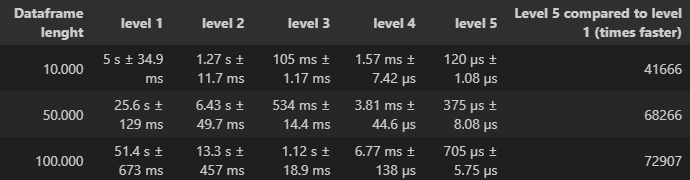

# Making your tabular data manipulation thousands times faster

## Objective and Motivation

This project focuses on demonstrating how it is possible to perform tabular data operations in different ways, increasing their efficiency by applying vectorization and utilizing libraries that assist us in this endeavor, such as Numpy.

In the process of feature engineering, new data is added to our DataFrame, often based on existing columns. So, knowing vectorization techniques can be extremely useful in increasing the efficiency of your code, especially when dealing with large numbers of rows in your DataFrame.

## Subject of Study

### Vectorization

The main idea of vectorization is manipulate the entire column at once, instead of iterating each row specifically.

By doing so, you treat columns arithmetically, i.e., as vectors that interact mathematically with each other, in order to meet the logic of your solution.

A powerful tool that can assist us in vectorization is the Numpy library. In Numpy, element-wise operations are the default mode when an ndarray is involved. These operations are internally developed in C by Numpy, which leads to more efficient memory allocation.

### Dataset

The dataset used for this study consists of randomly generated example data using Numpy. It includes the following columns:

- age: representing the person's age
- time_on_socialmedia_per_day(hours): time spent on social media per day in hours
- number_of_workouts_per_week: the number of weekly workouts
- food_routine: categorizing the person's eating habits into 5 possible categories
- avg_time_sleeping: average sleep time

The initial dataset contains 10,000 rows, but we will see throughout the results that as the dataset size increases, vectorization becomes more useful and advantageous.

## Method

Here, our goal is to create a new column called "Need Doctor", indicating whether a person should be recommended to see a doctor based on certain conditions related to the dataset.

The conditions for recommending a doctor are as follows:

Being 40+ years old and meeting one of the following characteristics:
- Spending more than 4 hours per day on social media
- Having 1 or fewer workouts per week
- Having an irregular or unhealthy food routine
- Sleeping less than 4 hours per night
  
The "Need Doctor" column should be set to True if the conditions are met; otherwise, it should be set to False.

To measure the efficiency of different ways to solve this task, we have defined five levels of resolution, numbered from 1 to 5, representing the least efficient to the most efficient approaches.

## Development

To start the study, we import the pandas and numpy libraries and create our DataFrame.

``````python
import pandas as pd
import numpy as np

df = pd.DataFrame()

size = 10000

df['age'] = np.random.randint(0, 100, size)
df['time_on_socialmedia_per_day(hours)'] = np.random.uniform(0, 5, size)
df['number_of_workouts_per_week'] = np.random.randint(0, 10, size)
df['food_routine'] = np.random.choice(['healthy', 'balanced', 'moderate', 'irregular', 'unhealthy'], size)
df['avg_time_sleeping'] = np.random.uniform(0, 10, size)
``````

For Level 1, we implemented two functions: one to check a person's age in our dataset, and another to check the conditions for recommending a doctor.

``````python
def check_age(age)
    if age > 40
        return True
    else
        return False

def recommend_doctor(column, value)
    if (
        (column == 'time_on_socialmedia_per_day(hours)') and (value = 4) or
        (column == 'number_of_workouts_per_week') and (value = 1) or
        (column == 'food_routine') and ((value == 'irregular') or (value == 'unhealthy')) or
        (column == 'avg_time_sleeping') and (value = 4)
    )
        return True
    else
        return False
``````
### Level 1

We iterate over our DataFrame using both functions to create the new column "Need Doctor (1)".

``````python
%%timeit

df['Need Doctor (1)'] = None
for column in ['time_on_socialmedia_per_day(hours)', 'number_of_workouts_per_week', 'food_routine', 'avg_time_sleeping']    
    for index in range(len(df))
        age = df.loc[index, 'age']

        if (check_age(age) == True) and (recommend_doctor(column, df.loc[index, column]) == True)
            df.loc[index, 'Need Doctor (1)'] = True
        
        else

         if (df.loc[index, 'Need Doctor (1)'] == True)
             None

         else 
             df.loc[index, 'Need Doctor (1)'] = False
``````
It is possible to observe the lack of performance when iterating twice, first to find the column name and then to iterate over each element of the column. The conditionals are structured in this way to avoid overwriting the result when checking two different columns, preventing the Need Doctor value from being set to True and then being overwritten by False in the next iteration.

### Level 1 results

After applying the %%timeit functionality, which runs the code block multiple times and returns the average time and the standard deviation, we obtain the following result:

 _5 s ± 34.9 ms per loop (mean ± std. dev. of 7 runs, 1 loop each)_ 

### Level 2

Next, we compare the same task using the .iterrows() method from pandas, which considers each row of the DataFrame as a series. This eliminates the need to iterate to select the column name and simplifies the code in our function and iteration.

``````python
def recommend_doctor2(row)
    if row['age'] = 40
        if (
            (row['time_on_socialmedia_per_day(hours)'] = 4) or
            (row['number_of_workouts_per_week'] = 1) or
            (row['food_routine'] == 'irregular' or row['food_routine'] == 'unhealthy') or
            (row['avg_time_sleeping'] = 4)
        )
            return True
        else
            return False
    else
        return False

%%timeit
for index, row in df.iterrows()
    df.loc[index, 'Need Doctor (2)'] = recommend_doctor2(row)
``````
### Level 2 results

Applying %%timeit only to the iteration using the iterrows() method, our result was:

_1.27 s ± 11.7 ms per loop (mean ± std. dev. of 7 runs, 1 loop each)_

### Level 3

Level 3 uses the same recommend_doctor2 function, but now we use another pandas method, the .apply() function.

.apply() applies a function to a DataFrame, and the "axis" parameter indicates that we want to apply it row by row (it would be column-wise if axis = 0). This eliminates the need for loops entirely.

``````python
%%timeit
df['Need Doctor (3)'] = df.apply(recommend_doctor2, axis = 1)
``````

### Level 3 results

The obtained result was:

_105 ms ± 1.17 ms per loop (mean ± std. dev. of 7 runs, 10 loops each)_

### Level 4

Level 4 is where we start introducing the logic of vectorization, which means manipulating our Dataset columns as arrays.

Just as we can imagine the logic of our solution as an array of boolean operations, which interact by index with our Dataset arrays.

In this level, we first create the "Need Doctor (4)" column and assign all values as False. Then, we use the "loc" function to locate the rows where our condition is met and assign the value True to those rows.

``````python
%%timeit
df['Need Doctor (4)'] = False

df.loc[(df['age'] = 40) &
         ((df['time_on_socialmedia_per_day(hours)'] = 4) 
          (df['number_of_workouts_per_week'] = 1)  
          (df['food_routine'].isin(['irregular', 'unhealthy']) 
          (df['avg_time_sleeping'] = 4))
        ), 'Need Doctor (4)'
] = True
``````
 ### Level 4 results

1.57 ms ± 7.42 µs per loop (mean ± std. dev. of 7 runs, 1,000 loops each)

 ### Level 5

 in our final level, we also apply vectorization, but this time we use Numpy to calculate it. The fact that Numpy performs pre-calculations in a lower-level language before returning the result to Python brings a drastic improvement in speed.

 For its application, we use the "np.select()" function, where three arguments are passed. The first argument represents the conditions to be checked, the second argument is what to do if those conditions are met, and the third argument is what to do if the conditions are not met.

 ``````python
conditions = [
    (
        df['age'] = 40) & 
        (
            (df['time_on_socialmedia_per_day(hours)'] = 4) 
            (df['number_of_workouts_per_week'] = 1) 
            (df['food_routine'].isin(['irregular', 'unhealthy'])) 
            (df['avg_time_sleeping'] = 4)
        )
    
]

choices = [
True,
]

%%timeit
df['Need Doctor (5)'] = np.select(conditions, choices, default = False)
 ``````
Only one condition is applied, which is a check to determine if a person should be recommended to a doctor. In this case, we assign the value True to choices, and our default parameter for the opposite case is set to False.

### Level 5 results

120 µs ± 1.08 µs per loop (mean ± std. dev. of 7 runs, 10,000 loops each)


## Graphical Analysis

To analyze our results, a DataFrame was created to synthesize all the obtained values.



We can see a significant improvement of several orders of magnitude in all three cases as the DataFrame size increases.

This comparison is better observed through the graphical analysis presented below:

### Figure 1


It is possible to observe that all levels follow a linear relationship between the time it takes for the code to run and the size of the DataFrame. We can see that using seconds in time scale, the DataFrame size is almost irrelevant for levels 4 and 5, as their slopes are very close to 90 degrees. On the other hand, levels 1 and 2 show a significant increase in time as the DataFrame size increases.


### Figure 2


Here, when comparing the speed of level 5 relative to level 1, we can see an increase in code efficiency as the dataset size grows. We can examine this behavior in more detail based on Figure 3.


### Figure 3


Based on the collected data, we can see a drastic improvement in behavior for DataFrame sizes ranging from 10,000 to 100,000 rows, and it appears to stabilize for sizes above 100,000 rows.


